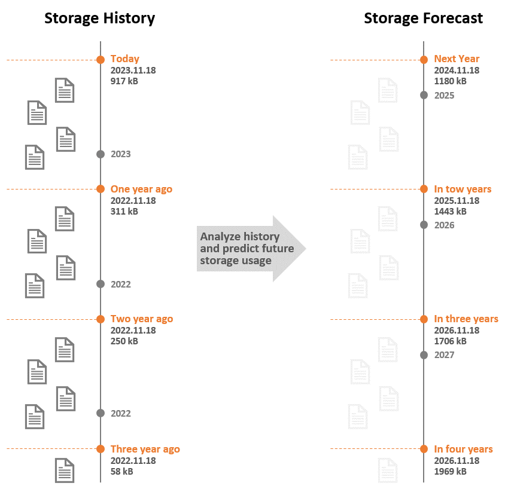

[](https://opensource.org/licenses/Apache-2.0)

# Storage Forecast
Storage Forecast offers a simple command line interface to predict future storage capacity requirements. First, files on the existing file system are analysed based on their creation date and grouped into appropriate time buckets. Second, the future storage capacity usage is predicted based on the analysed history. The following schematic graphic illustrates the concept:



In practice, the command line result contains a summary representing relevant metadata, a history illustrating the historic capacity growth, and the forecast predicting the future storage capacity requirements. The time bucket interval is automatically determined based on the analysed time frame. Possible bucket intervals are one year, one month, one day, and one hour. The slope contained in the summary expresses the growth for the selected time interval. Based on the slope the future storage capacity usage is predicted. The following sample output illustrates the command line usage:

```
== Summary ==
Number of files:   1929
Size of files:     274.45 MB
Interval start:    2019.06.01
Interval end:      2023.11.21
Interval duration: 4years 5months 20days 12h 12m 16s
Group interval:    1year
Slope:             54.89 MB/year

== History ==
2019.11.21      605 B
2020.11.20      605 B
2021.11.21      605 B
2022.11.21    1.41 kB
2023.11.21  274.45 MB

== Forecast ==
2024.11.20  329.34 MB
2025.11.21  384.23 MB
2026.11.21  439.12 MB
2027.11.21  494.01 MB
2028.11.20  548.90 MB
2029.11.21  603.79 MB
2030.11.21  658.69 MB
2031.11.21  713.58 MB
2032.11.20  768.47 MB
2033.11.21  823.36 MB
2034.11.21  878.25 MB
2035.11.21  933.14 MB
2036.11.20  988.03 MB
2037.11.21    1.04 GB
2038.11.21    1.10 GB
2039.11.21    1.15 GB
2040.11.20    1.21 GB
2041.11.21    1.26 GB
2042.11.21    1.32 GB
2043.11.21    1.37 GB
2044.11.20    1.43 GB
2045.11.21    1.48 GB
2046.11.21    1.54 GB
2047.11.21    1.59 GB
2048.11.20    1.65 GB
2049.11.21    1.70 GB
2050.11.21    1.76 GB
```

## Usage
Download the binary from the latest release and use the following command:
```
storage-forecast -p <mydir>
```
## Development
Prerequisite: Ensure Rust is installed, see [installation guide](https://www.rust-lang.org/tools/install).

**Run:** 
```
cargo run --bin storage-forecast -- -p <mydir>
```

**Build:**
```
cargo build
```

**Run tests including integration tests:**
```
cargo test --verbose
```

**Run Clippy:**
```
cargo clippy --all-targets --all-features
```

**Release:**

Increase version in `Cargo.tomel` and add git version git tag `v*` e.g: `v1.0.0`.

## Known Limitations
Currently, the prediction supports only linear regression. For some long-term use cases an exponential approximation would might fit better.